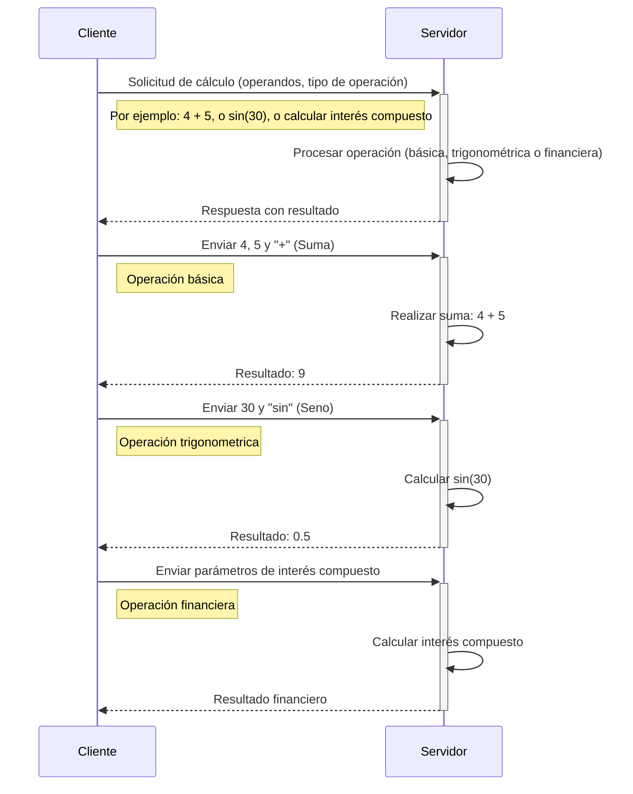

```mermaid
sequenceDiagram
participant Cliente
participant Servidor

Cliente->>+Servidor: Solicitud de cálculo (operandos, tipo de operación)
Note right of Cliente: Por ejemplo: 4 + 5, o sin(30), o calcular interés compuesto
Servidor->>Servidor: Procesar operación (básica, trigonométrica o financiera)
Servidor-->>-Cliente: Respuesta con resultado

Cliente->>+Servidor: Enviar 4, 5 y "+" (Suma)
Note right of Cliente: Operación básica
Servidor->>Servidor: Realizar suma: 4 + 5
Servidor-->>-Cliente: Resultado: 9

Cliente->>+Servidor: Enviar 30 y "sin" (Seno)
Note right of Cliente: Operación trigonometrica
Servidor->>Servidor: Calcular sin(30)
Servidor-->>-Cliente: Resultado: 0.5

Cliente->>+Servidor: Enviar parámetros de interés compuesto
Note right of Cliente: Operación financiera
Servidor->>Servidor: Calcular interés compuesto
Servidor-->>-Cliente: Resultado financiero
```