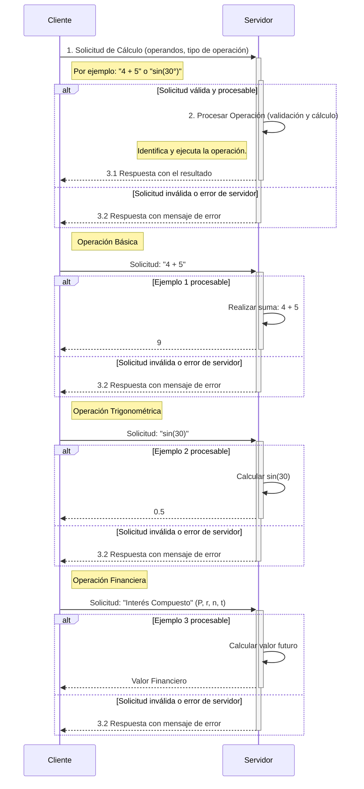

```mermaid
sequenceDiagram

    participant Cliente
    participant Servidor

    Cliente->>+Servidor: 1. Solicitud de Cálculo (operandos, tipo de operación)
    Note right of Cliente: Por ejemplo: "4 + 5" o "sin(30°)"

    activate Servidor
    alt Solicitud válida y procesable
        Servidor->>Servidor: 2. Procesar Operación (validación y cálculo)
        Note left of Servidor: Identifica y ejecuta la operación.
        Servidor-->>-Cliente: 3.1 Respuesta con el resultado
    else Solicitud inválida o error de servidor
        Servidor-->>-Cliente: 3.2 Respuesta con mensaje de error
    end

    Note right of Cliente: Operación Básica
    Cliente->>+Servidor: Solicitud: "4 + 5"

    activate Servidor

    alt Ejemplo 1 procesable
        Servidor->>Servidor: Realizar suma: 4 + 5
        Servidor-->>-Cliente: 9
    else Solicitud inválida o error de servidor
        Servidor-->>-Cliente: 3.2 Respuesta con mensaje de error
    end


    Note right of Cliente: Operación Trigonométrica
    Cliente->>+Servidor: Solicitud: "sin(30)"

    activate Servidor

    alt Ejemplo 2 procesable
        Servidor->>Servidor: Calcular sin(30)
        Servidor-->>-Cliente: 0.5
    else Solicitud inválida o error de servidor
        Servidor-->>-Cliente: 3.2 Respuesta con mensaje de error
    end

    Note right of Cliente: Operación Financiera
    Cliente->>+Servidor: Solicitud: "Interés Compuesto" (P, r, n, t)

    activate Servidor
    alt Ejemplo 3 procesable
        Servidor->>Servidor: Calcular valor futuro
        Servidor-->>-Cliente: Valor Financiero
    else Solicitud inválida o error de servidor
        Servidor-->>-Cliente: 3.2 Respuesta con mensaje de error
    end
```
